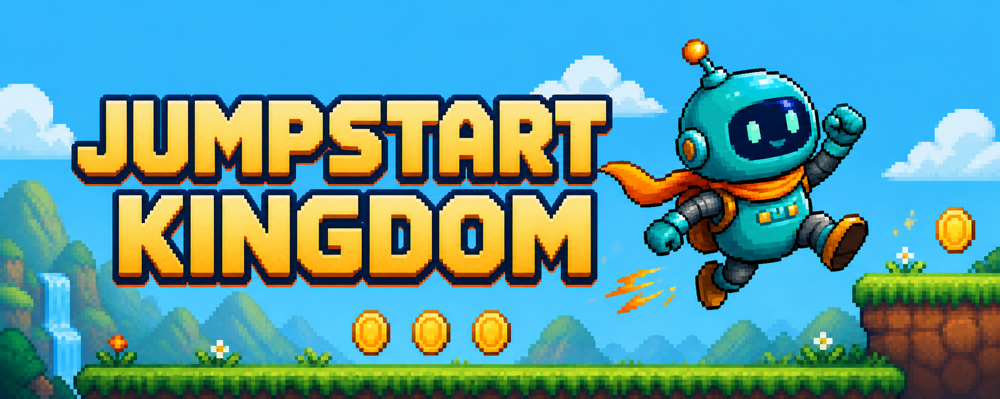

<p align="center">
  
</p>

<h1 align="center">Jumpstart Kingdom</h1>

<p align="center">
  A cheerful browser platformer about quick jumps, golden collectibles, and tiny purple troublemakers.
</p>

<p align="center">
  <a href="https://khengyun.itch.io/jumpstart-kingdom"><strong>Play in your browser</strong></a>
  ·
  <a href="https://khengyun.itch.io/">More games by Ken</a>
</p>

<p align="center">
  <a href="https://github.com/khengyun/jumpstart-kingdom/actions/workflows/godot-export.yml">
    
  </a>
</p>

## About

Jumpstart Kingdom is a six-stage 2D platformer built with Godot 4.7. Run across grassy platforms, collect golden pickups, survive moving platforms and explosive traps, stomp robot enemies, activate checkpoints, and defeat the Radial Core Guardian.

The game is designed at 960×540, uses the GL Compatibility renderer, and can be played directly in a modern desktop browser.

## Features

- Responsive movement with separate ground and air acceleration.
- Coyote time, jump buffering, variable-height jumping, and a second aerial jump.
- Collectibles, scoring, hazards, pits, checkpoints, and a three-life run system.
- Stompable ground patrols, reusable flying scouts, and two-second sentry shooters.
- Stable horizontal rocket lifts and proximity mines with visible fiery shockwaves.
- A 9,200px final gauntlet with five mandatory lift crossings, four checkpoints,
  and a hovering three-hit radial-projectile boss.
- Pause, restart, automatic animated transitions between stages, and final run menus.
- Five-state robot animation: idle, run, jump, fall, and shutdown.
- Original pixel-art background, terrain, animated pickups, and animated enemies.
- Wind-blown checkpoint and goal flags with raising and lowering animations.
- Mechanical spike artwork layered over stable gameplay hitboxes.
- Start, pause, settings, about, and level-complete menus with keyboard focus.
- A DEV MODE level picker generated from every discovered `level_*.tscn` map.
- Editor-visible level scenes with draggable and resizable map components.
- Export-safe automatic discovery and natural ordering of `level_*.tscn` scenes.
- Sixteen reproducible, game-specific sound effects adapted only from Pixabay recordings.
- Automated Web builds and itch.io deployment through GitHub Actions.

## Controls

| Action | Keyboard |
| --- | --- |
| Move left | `A` or `←` |
| Move right | `D` or `→` |
| Jump / double jump | `Space`, `W`, or `↑` |
| Respawn / restart | `R` |
| Pause / resume | `Esc` |

## Run Locally

### Requirements

- Godot 4.7.x. The CI build currently uses Godot 4.7.1.
- Git, if you want to clone the repository.

Clone and open the project:

```bash
git clone https://github.com/khengyun/jumpstart-kingdom.git
cd jumpstart-kingdom
godot --editor --path .
```

Press `F5` in the editor, or launch the game directly:

```bash
godot --path .
```

For a Flatpak installation of Godot:

```bash
flatpak run --filesystem="$PWD" org.godotengine.Godot --editor --path .
flatpak run --filesystem="$PWD" org.godotengine.Godot --path .
```

Run the same headless checks used during development:

```bash
godot --headless --editor --path . --quit
godot --headless --path . --quit-after 180
```

## Project Structure

```text
.
├── assets/branding/      # Project icon used by exported builds
├── assets/audio/         # Processed SFX, source records, and reproducible build script
├── assets/environment/   # Background plate and repeatable terrain textures
├── assets/enemies/       # Patrol, flying, sentry, projectile, and boss artwork
├── assets/hazards/       # Spikes, proximity mine, and shockwave artwork
├── assets/objects/       # Animated flag sheet and animation resource
├── assets/pickups/       # Circuit coin sprite sheet and animation resource
├── assets/player/        # Robot sprite sheet and animation resource
├── assets/ui/            # Shared normal-font menu theme
├── marketing/itch/       # Storefront artwork; excluded from game exports
├── scenes/components/    # Reusable platforms, hazards, and checkpoints
├── scenes/levels/        # Auto-discovered level_*.tscn maps in play order
├── scenes/ui/            # HUD and reusable menu scenes
├── scripts/              # App state, session, gameplay, editor tools, and UI
├── docs/                 # Project editing guides
├── .github/workflows/    # Web build and itch.io deployment pipeline
├── .vscode/              # Optional Flatpak tasks and Godot debug settings
├── export_presets.cfg    # Godot Web export preset
└── project.godot         # Project settings, input map, and entry scene
```

The collision layers are named `World`, `Player`, `Enemy`, and `Pickup`. Storefront artwork lives under `marketing/` and is kept out of Godot imports and release bundles by `marketing/.gdignore`.

The exact built-in image-generation prompts and post-processing approach for
the mine, sentry, projectile, boss, shockwave, and hover lift are recorded in
[`docs/IMAGEGEN_PROMPTS.md`](docs/IMAGEGEN_PROMPTS.md).

The included VS Code tasks open or run the project through Flatpak. Debug launch configurations use the recommended `geequlim.godot-tools` extension.

## Edit or Add Levels

Open a scene under `scenes/levels/` to edit a map visually. Fixed platforms and
spike strips can be moved and resized directly. Moving platforms, mines, coins,
enemies, checkpoints, the goal, and the spawn marker are reusable scene
instances that can be placed in the 2D viewport.

Levels are discovered automatically by `LevelCatalog` through
`ResourceLoader.list_directory()` and `ResourceLoader.load()`, so discovery also
works inside exported builds. Every `.tscn` file directly under
`scenes/levels/` whose name begins with `level_` is included. Files are played
in natural, case-insensitive filename order, so `level_2.tscn` comes before
`level_10.tscn`; zero-padded names such as `level_01.tscn` are recommended.
There is no level array to update in `scenes/main.tscn`.

The main menu's **DEV MODE** button reads this same catalog and builds its
level buttons at runtime. A newly saved valid `level_*.tscn` scene therefore
appears in the selector automatically, with no UI or script list to maintain.
Choosing a map starts a fresh three-life run directly on that level.

Each level must use a `Node2D` root with `scripts/level.gd` (`GameLevel`) and
retain this scene contract:

```text
GameLevel
├── Terrain
├── Pickups
├── Enemies
├── GameplayAreas
└── Markers
    └── PlayerSpawn
```

`Markers/PlayerSpawn` is required. `Pickups`, `Enemies`, and `GameplayAreas`
are the signal-discovery branches for coins, defeated enemies, checkpoints,
and goals. Set the root's exported `Level Title`, `Level Bounds`, and
`Background Texture`; camera limits, HUD text, and the active backdrop are
derived from those values.

To add a level:

1. Duplicate the closest existing scene and save it directly under
   `scenes/levels/` as the next `level_XX.tscn` file.
2. Rename the root, then update `Level Title`, `Level Bounds`, and
   `Background Texture` in the Inspector.
3. Keep the required branches and move or instance terrain and gameplay
   components beneath the matching branch.
4. Add reusable pieces under the matching branch:
   - `scenes/components/moving_platform.tscn` under `Terrain` for a horizontal
     platform with editable travel distance, speed, and initial direction.
   - `scenes/components/explosive_hazard.tscn` under `GameplayAreas` for a
     one-shot proximity mine with editable trigger and blast radii.
   - `scenes/flying_enemy.tscn` or `scenes/shooter_enemy.tscn` under `Enemies`
     for an aerial patrol or two-second projectile sentry.
5. To make a boss goal, place `scenes/radial_boss.tscn` under `Enemies` and set
   the goal's `Required Group` to `level_boss`. The goal unlocks as soon as no
   boss remains in that group.
6. Save the scene. It will be discovered automatically on the next run and in
   the Web export.

Reaching a goal automatically loads the next discovered level through the
stage transition. The completion menu appears only after the final available
level, so no menu interrupts the run between maps.

`GameLevel` searches the gameplay branches recursively, so reusable patrol,
flying, shooter, and boss instances beneath `Enemies` automatically contribute
their `defeated` signals to scoring. See the step-by-step
[level editing guide](docs/LEVEL_EDITING.md) for viewport editing details.

## Lives and Game Over

A new run starts with three lives. Each death increments the death counter and
removes one life; the HUD immediately updates its three energy-core icons.
When lives remain, the player respawns at the latest checkpoint. At zero lives,
the session plays `game_over.wav`, emits its run-lost state, and opens the lost
menu with the level title, final score, retry, settings, about, and main-menu
actions. Retrying restores three lives and the score and coin totals recorded
at the start of that level.

## Sound Effects

The game ships with 16 mono 44.1 kHz, 16-bit WAV effects, including movement,
pickups, enemies, flags, menus, level completion, and `game_over.wav`. Every
effect is a game-specific adaptation of a recording sourced through Pixabay;
no AI-generated or non-Pixabay sound source is part of the set.

[`assets/audio/SOURCES.md`](assets/audio/SOURCES.md) records each Pixabay page,
contributor, download URL, SHA-256 checksum, output mapping, and license notes.
The checked-in WAV files can be rebuilt from the recorded inputs and recipe with:

```bash
bash assets/audio/build_pixabay_sfx.sh
```

The script requires `curl`, `sha256sum`, and FFmpeg with the `rubberband`
filter. It downloads sources into a temporary directory, verifies their hashes,
performs the documented trims, layering, pitch/EQ, fades, and limiting, then
deletes the source MP3 files. Only the processed gameplay WAV files are tracked.

## Web Export

Install the matching Godot export templates, then run:

```bash
mkdir -p build/web
godot --headless --path . --export-release Web build/web/index.html
```

The exported directory must keep `index.html`, the `.wasm` file, the `.pck` file, and the remaining generated files together.

## Continuous Delivery

The [`Build and Deploy Web`](.github/workflows/godot-export.yml) workflow runs for pushes to `main`, `v*` tag pushes, pull requests targeting `main`, and manual dispatches. It:

1. imports and validates the Godot project;
2. runs a headless smoke test;
3. exports and verifies the Web bundle;
4. stores the bundle as a GitHub Actions artifact for 14 days;
5. automatically deploys every successful `main` push, `v*` tag build, or manual run to the itch.io `web` channel.

Pull requests run the complete validation and export pipeline but never deploy
to production. The deploy job depends on `build-web`, so Butler cannot upload a
bundle unless import, smoke testing, export, bundle verification, and artifact
upload have all succeeded.

Production deployment requires the repository secret `BUTLER_API_KEY`, the repository variable `ITCH_GAME`, and an existing itch.io HTML project matching that slug. The workflow validates the target page before uploading with Butler. After the first upload, mark the `web` upload as **HTML5 / Playable in browser** in the itch.io editor.

## Credits

Created by [Ken](https://khengyun.itch.io/) with [Godot Engine](https://godotengine.org/). Gameplay code and runtime artwork are original to this project.

All 16 sound effects are game-specific adaptations of recordings by [Pixabay](https://pixabay.com/sound-effects/) contributors under the Pixabay Content License. Exact sources, contributor credits, and the reproducible processing script are documented in [`assets/audio/SOURCES.md`](assets/audio/SOURCES.md).

The processed WAV files are tracked with the project, so clean GitHub Actions and itch.io builds include the same sound set as local builds.

This independent project is not affiliated with Nintendo and contains no Nintendo characters, names, or assets.
